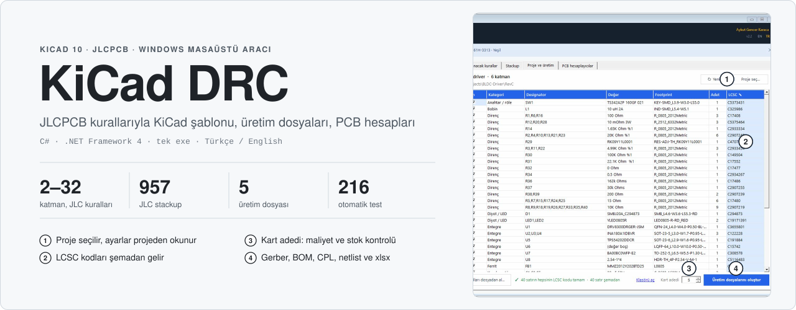
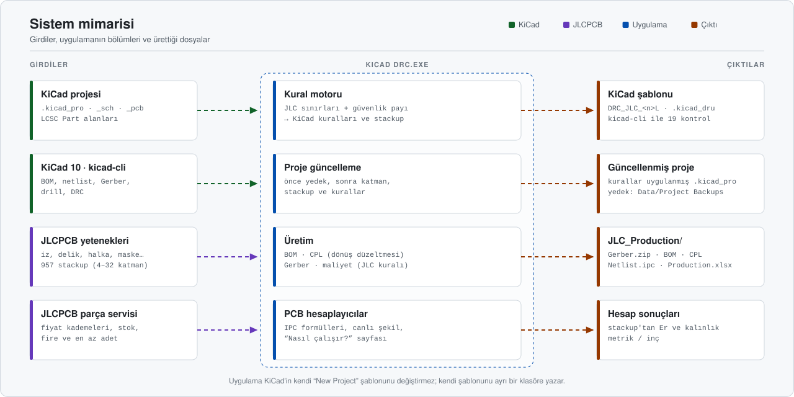
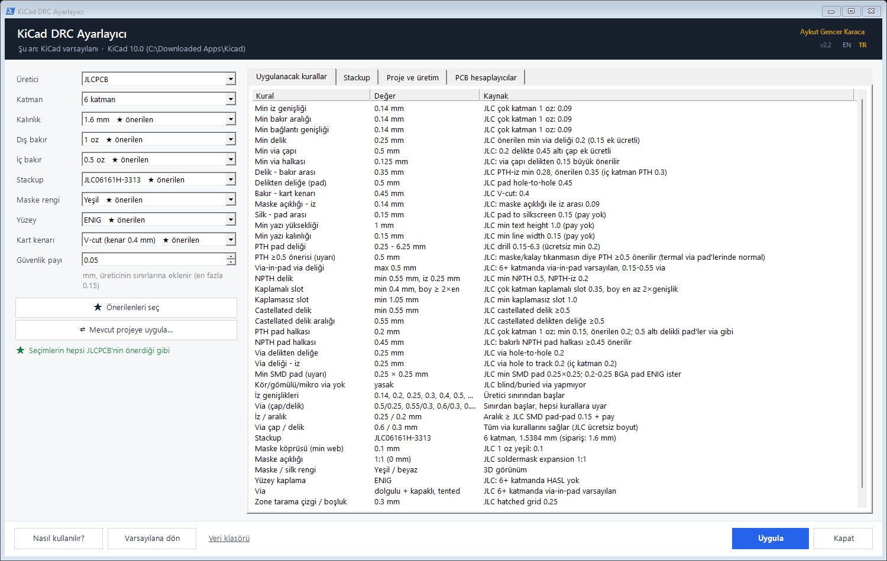
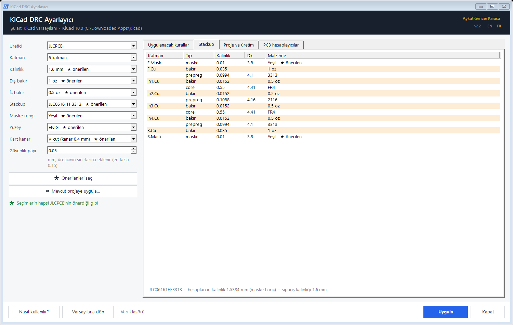
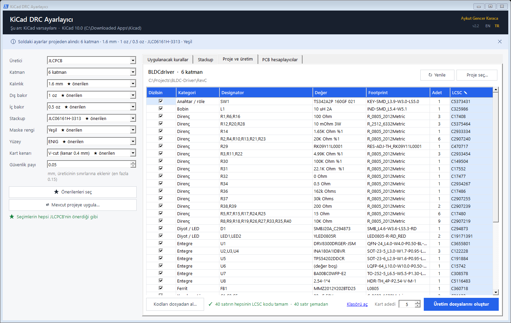
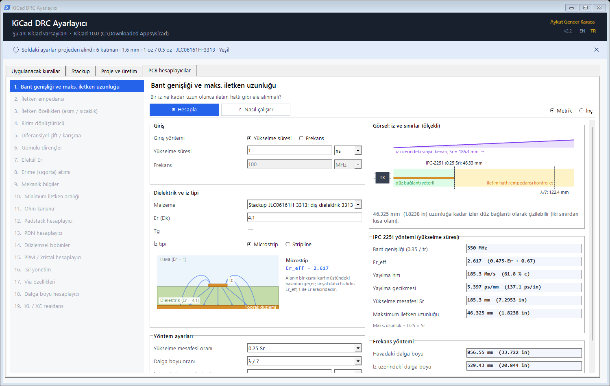
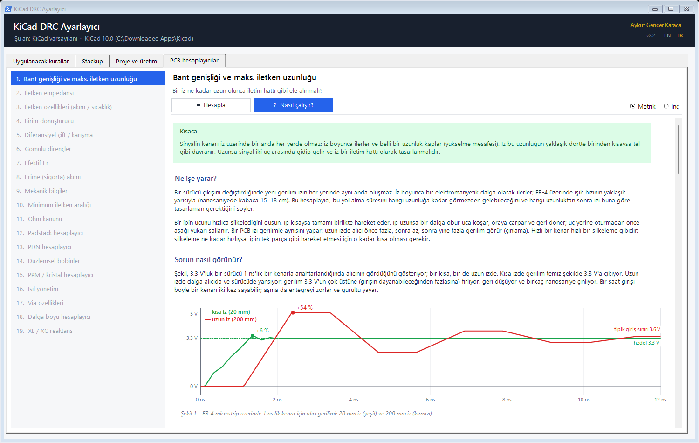

<div align="center">



<br/>

<a href="#-sistem-mimarisi"></a>
<a href="#-üretim-dosyaları"></a>
<a href="#-kaynaktan-derleme"></a>


<br/><br/>

**KiCad projelerini JLCPCB'nin üretim sınırlarına göre kuran, üretim dosyalarını tek tıkla çıkaran Windows aracı.**<br/>
Kurallar, stackup, Gerber, BOM, CPL, maliyet ve PCB hesapları tek bir taşınabilir exe'de.

</div>


## İçindekiler

- [Genel bakış](#-genel-bakış)
- [Öne çıkanlar](#-öne-çıkanlar)
- [Sistem mimarisi](#-sistem-mimarisi)
- [Kurulum](#-kurulum)
- [Kullanım](#-kullanım)
- [Üretim dosyaları](#-üretim-dosyaları)
- [PCB hesaplayıcıları](#-pcb-hesaplayıcıları)
- [Doğrulama ve testler](#-doğrulama-ve-testler)
- [Kaynaktan derleme](#-kaynaktan-derleme)
- [Sınırlamalar](#-sınırlamalar)
- [Depo yapısı](#-depo-yapısı)

## ◆ Genel bakış

KiCad'de yeni bir kart tasarlarken üreticinin sınırlarını (en ince iz, en küçük delik, halka, maske açıklığı, stackup…) tek tek girmek hem zaman alır hem de hataya açıktır. Bu uygulama **JLCPCB**'nin yayımladığı sınırları KiCad kurallarına çevirir. Yeni projeler için hazır bir şablon yazar ya da kuralları mevcut bir projeye uygular. Tasarım bitince de JLCPCB'nin istediği **Gerber, BOM, CPL** ve netlist dosyalarını, maliyet tahminiyle birlikte üretir.

| Özellik | Değer |
|---|---|
| **Üretici** | JLCPCB (yeni üretici eklemek için tek bir sınıf yazılır) |
| **Katman** | 2 – 32 · JLC'nin sipariş sayfasındaki 957 stackup uygulamaya gömülü |
| **Seçimler** | Kalınlık, dış / iç bakır, stackup, maske rengi, yüzey kaplama, kart kenarı (V-cut / freze), güvenlik payı (0 – 0.15 mm) |
| **KiCad çıktısı** | Proje şablonu `DRC_JLC_<n>L`: kurallar, net class, iz / via ön ayarları, stackup, `.kicad_dru` özel kuralları |
| **Üretim çıktısı** | Gerber + drill zip, BOM, CPL, IPC-D-356 netlist, `Production.xlsx` (özet, maliyet, BOM, CPL) |
| **Parça kodları** | Şemadaki `LCSC Part` alanından okunur; eksikler uygulamada girilebilir ya da dosyadan alınabilir |
| **Hesaplayıcılar** | 19 PCB hesaplayıcısı planlı; 1. hazır (bant genişliği ve maks. iletken uzunluğu) |
| **Gereksinim** | Windows 10 / 11 · KiCad 10 · kurulum yok, tek exe |

## ◆ Öne çıkanlar

<table>
<tr>
<td width="50%" valign="top">

**Kurallar KiCad'in kendisiyle doğrulanıyor**<br/>
"Uygula"dan sonra uygulama, bilerek hatalı yapılmış 19 öğe içeren bir test kartı yazıp `kicad-cli` ile DRC çalıştırır. Her kural kendi hatasını yakalamalı, kurala uyan öğelerde yanlış alarm olmamalıdır.

</td>
<td width="50%" valign="top">

**Mevcut projeye güvenli uygulama**<br/>
Katman sayısını artırıp azaltabilir, stackup ve kuralları değiştirir. Önce projenin yedeğini alır; işlemden sonra öğe sayılarını karşılaştırır, bir sorun olursa yedeği geri yükler.

</td>
</tr>
<tr>
<td valign="top">

**JLC'nin faturalayacağı adetle maliyet**<br/>
Parça fiyatı, JLC'nin fire payı ve en az sipariş adedi eklenmiş adetin fiyat kademesiyle hesaplanır. Formül JLC'nin canlı hesaplayıcısıyla 1080 denemede birebir aynı çıktı.

</td>
<td valign="top">

**Doğru dönen CPL**<br/>
Alt yüz dönüşü, KiCad kütüphane footprint'leri için JLC dönüş düzeltmeleri, THT parçalar için pad merkezi. EasyEDA / LCSC footprint'leri zaten JLC yönünde çizildiği için döndürülmez.

</td>
</tr>
<tr>
<td valign="top">

**Kodlar şemada yaşar**<br/>
Parçayı yerleştirirken `E` ile açılan pencereye LCSC kodunu yazmanız yeterli. Uygulama projeyi seçince kodları şemadan okur, eksik olanları ve stok sorunlarını gösterir.

</td>
<td valign="top">

**Formülü gösteren hesaplayıcılar**<br/>
Her hesaplayıcının bir "Nasıl çalışır?" sayfası var: fiziksel açıklama, ölçekli şekiller, adım adım formül ve örnek. Değerler seçilen JLC stackup'ından gelir.

</td>
</tr>
</table>

## ◆ Sistem mimarisi

<p align="center">
  
</p>

Uygulama üç kaynaktan beslenir:
- **KiCad projesi:** şema, PCB ve proje ayarları.
- **`kicad-cli`:** KiCad'in komut satırı aracı. BOM, netlist, Gerber, drill ve DRC için kullanılır.
- **JLCPCB'nin herkese açık sayfaları ve servisleri:** üretim sınırları, stackup listesi, parça fiyatı ve stoğu.

Kural motoru seçimleri KiCad kurallarına çevirir. Kurallar ya ayrı bir klasördeki şablona ya da mevcut projeye yazılır. Üretim bölümü dosyaları projenin içindeki `JLC_Production` klasörüne koyar.

## ◆ Kurulum

1. [Releases](../../releases/latest) sayfasından `KiCad.DRC.exe` dosyasını indirin. GitHub dosya adındaki boşluğu noktaya çevirir; isterseniz adını `KiCad DRC.exe` yapabilirsiniz.
2. Kendi klasörüne koyun, örneğin `C:\Projects\DRC\KiCad DRC.exe`. Uygulama verilerini (`Data\`) exe'nin yanına yazar.
3. Çalıştırın. KiCad'in yeri otomatik bulunur; bulunamazsa sorulur.

> [!IMPORTANT]
> Exe'yi **Masaüstü** ya da **Belgeler** içine koymayın. Windows'un "Denetimli klasör erişimi" özelliği oraya yazmayı engelleyebilir.

> [!NOTE]
> İnternet yalnızca parça bilgisi (üretici, stok, fiyat) için gerekir. Bağlantı yoksa üretim dosyaları yine oluşur; xlsx'teki fiyat sütunları boş kalır.

## ◆ Kullanım

<details open>
<summary><b>1 · Kuralları seçin ve KiCad şablonu oluşturun</b></summary>
<br/>

Solda üretici, katman, kalınlık, bakır, stackup, maske, yüzey ve kart kenarını seçin. **★ önerilen**, JLCPCB'nin varsayılanıdır. "Uygulanacak kurallar" sekmesi her kuralın değerini ve kaynağını gösterir. **Uygula** düğmesi şablonu yazar ve KiCad ile doğrular. Ardından KiCad'de *File › New Project from Template* içinde `DRC_JLC_<n>L` seçilebilir.

<p align="center"></p>

</details>

<details>
<summary><b>2 · Stackup</b></summary>
<br/>

Seçilen JLC stackup'ının katmanları, kalınlıkları, Dk değerleri ve malzemeleri. Hesaplanan toplam kalınlık sipariş kalınlığıyla birlikte gösterilir.

<p align="center"></p>

</details>

<details>
<summary><b>3 · Mevcut projeye uygulayın</b></summary>
<br/>

**Mevcut projeye uygula…** seçilen kuralları açık olmayan bir KiCad projesine yazar:
- katman sayısı ve stackup;
- kart kuralları ve iz / via ön ayarları;
- uygulamanın `.kicad_dru` bloğu (kullanıcının kendi kuralları korunur ve önceliklidir).

Silinecek bir katmanda öğe varsa ya da proje KiCad'de açıksa işlem yapılmaz.

</details>

<details>
<summary><b>4 · Üretim dosyalarını oluşturun</b></summary>
<br/>

"Proje ve üretim" sekmesinde projeyi seçin:
- soldaki ayarlar projeden okunur;
- BOM şemadan gelir;
- LCSC kodları şemadaki `LCSC Part` alanından okunur (mavi satırlar).

Elle dizilecek parçaların **Dizilsin** işaretini kaldırın, kart adedini girin ve **Üretim dosyalarını oluştur** düğmesine basın.

<p align="center"></p>

</details>

## ◆ Üretim dosyaları

Dosyalar `<proje>\JLC_Production\` klasörüne yazılır. Revizyon, PCB başlık bloğundan ya da klasör adından (`RevC`) alınır.

| Dosya | İçerik |
|---|---|
| `<ad>_Rev<x>_Gerber.zip` | Gerber (zone'lar yeniden doldurulmuş, silkscreen'den maske açıklıkları çıkarılmış) + Excellon drill (mm), PTH / NPTH ayrı, drill haritası |
| `<ad>_Rev<x>_BOM_JLC.csv` | `Designator, Footprint, Quantity, Value, LCSC Part #` |
| `<ad>_Rev<x>_CPL_JLC.csv` | `Designator, Mid X, Mid Y, Rotation, Layer` · yalnızca dizilecek parçalar |
| `<ad>_Rev<x>_Netlist.ipc` | IPC-D-356 netlist: JLC, Gerber'i bağlantılarla karşılaştırabilir |
| `<ad>_Rev<x>_Production.xlsx` | Sipariş özeti, maliyet tahmini, grafikler, BOM, CPL (seçili dilde, yazdırmaya hazır) |

BOM ve CPL sütunları, JLCPCB'nin KiCad rehberinde önerdiği [Fabrication Toolkit](https://github.com/bennymeg/Fabrication-Toolkit) eklentisiyle aynıdır.

<details>
<summary><b>CPL dönüşleri</b></summary>
<br/>

- Alt yüzdeki parçaların dönüşü `180 − açı` olarak yazılır.
- KiCad kütüphane footprint'lerinden sıfır yönü JLC'ninkinden farklı olanlar (SOT-23, SOIC, QFN…) Fabrication Toolkit tablosuna göre düzeltilir.
- EasyEDA / LCSC footprint'leri JLC yönünde çizildiği için düzeltilmez. Eklenti bunları adlarından tanıyıp fazladan döndürüyor; bu uygulama döndürmez.
- Kutuplu kondansatörler (CP_Elec, CP_EIA…) döndürülmez. JLC'deki yönleri seçilen parçaya bağlıdır; bu yüzden uygulama onları JLC önizlemesinde kontrol edilmek üzere listeler.
- THT parçalar pad'lerin merkezine yerleştirilir.

Düzeltilen her parça, üretimden sonra bir not olarak gösterilir. Siparişten önce JLC önizlemesinde bu parçalara bakmak yeterli.

</details>

<details>
<summary><b>Maliyet tahmini</b></summary>
<br/>

Parça fiyatları JLCPCB parça servisinden alınır ve 3 gün saklanır. JLC, ihtiyaçtan fazla parça faturalar:

$$\text{fire} = k \times \left(\text{loss} + \left\lfloor 0.002 \times \max(0,\ \text{ihtiyaç} - \text{makara}) \right\rfloor\right), \qquad k = \begin{cases} 1 & \text{tek yüz} \\ 2 & \text{iki yüz} \end{cases}$$

$$\text{faturalanan} = \max(\text{ihtiyaç} + \text{fire},\ \text{en az adet})$$

Fiyat kademesi faturalanan adete göre seçilir. Formül JLC'nin canlı PCBA hesaplayıcısıyla karşılaştırıldı: 1080 / 1080 satır aynı. Buna makara adedini aşan büyük siparişler de dahil.

Montaj ücretleri JLCPCB'nin [fiyat sayfasından](https://jlcpcb.com/help/article/pcb-assembly-price) alınır:
- kurulum, stencil ve parça besleme;
- SMT ve elle lehim noktaları, elle lehim işçiliği;
- bacaksız paketler (QFN / DFN / BGA) için X-ray;
- Standard PCBA paketlemesi.

Alt yüzde parça varsa Standard PCBA hesaplanır. Sayfanın kuralını vermediği ücretler (fikstür, pre-reflow, handling fee) toplama katılmaz, xlsx'te not olarak listelenir. Son fiyatı JLC'nin teklifi belirler.

</details>

## ◆ PCB hesaplayıcıları

Saturn PCB Toolkit'in 19 sekmesinin geliştirilmiş karşılıkları, yayımlanmış formüllerle (IPC standartları, el kitapları) yazılıyor. Değerler seçili JLC stackup'ından gelir; her hesaplayıcının bir **"Nasıl çalışır?"** sayfası var.

<table>
<tr>
<td width="50%"></td>
<td width="50%"></td>
</tr>
<tr>
<td align="center"><sub>1 · Bant genişliği ve maks. iletken uzunluğu</sub></td>
<td align="center"><sub>"Nasıl çalışır?": kısa ve uzun izde yansıma</sub></td>
</tr>
</table>

| # | Hesaplayıcı | Durum |
|:-:|---|---|
| 1 | Bant genişliği ve maks. iletken uzunluğu | ✅ Hazır · Saturn ile 265 / 265 değer karşılaştırıldı |
| 2 – 19 | İletken empedansı, iletken özellikleri, birim dönüştürücü, diferansiyel çift / karışma, gömülü dirençler, efektif Er, sigorta akımı, mekanik bilgiler, iletken aralığı, Ohm kanunu, padstack, PDN, düzlemsel bobinler, PPM / kristal, ısıl yönetim, via özellikleri, dalga boyu, XL / XC | Sırada |

Sonraki adım, hesaplayıcıları projeden beslemek. Planlananlar: net bazında kritik uzunluk, akım kapasitesi ve empedans kontrolü, karışma taraması, dönüş yolu boşlukları. Ayrıntılar [ROADMAP](Development/ROADMAP.md) dosyasında.

## ◆ Doğrulama ve testler

| Test | Ne yapar | Sonuç |
|---|---|---|
| `unit-tests.ps1` | Saf fonksiyonlar: dosya adları, fiyat kademeleri, JLC adet formülü (canlı hesaplayıcı değerleriyle), ücretler, CSV, S-expression, `.kicad_dru`, CPL dönüşleri, hesaplayıcı matematiği | 140 / 140 |
| `gui-tests.ps1` | Gerçek pencereyi ekran dışında sürer: dil değişimi, üretim sekmesi, projeye uygulama, uygula + doğrula, varsayılana dönüş (projenin kopyası üzerinde) | 50 / 50 |
| `run-tests.ps1` | 26 senaryoda (2 – 32 katman, bakır, kenar, maske…) KiCad doğrulaması | 26 / 26 |
| `saturn-compare-bandwidth.ps1` | 1. hesaplayıcı ile Saturn PCB Toolkit'in yan yana karşılaştırması | 265 / 265 |

Raporlar [`Development/Test Results`](Development/Test%20Results), hata ayıklama notları [`Development/Debug Reports`](Development/Debug%20Reports) klasöründe. Örnek üretim dosyası: [`sample_BLDCdriver_RevC_Production_TR.xlsx`](Development/Test%20Results/sample_BLDCdriver_RevC_Production_TR.xlsx).

<details>
<summary><b>Komut satırı</b></summary>
<br/>

```text
"KiCad DRC.exe" --help
"KiCad DRC.exe" --lang en --layers 6 --verify                       kuralları KiCad ile doğrula
"KiCad DRC.exe" --layers 6 --project X.kicad_pro --analyze          projeyi incele
"KiCad DRC.exe" --layers 6 --project X.kicad_pro --update           kuralları projeye uygula (yedekli)
"KiCad DRC.exe" --layers 6 --project X.kicad_pro --bom --build --boards 10
                                                                     BOM'u listele, üretim dosyalarını oluştur
```

Exe bir pencere uygulaması olduğu için PowerShell'de çıktıyı beklemek üzere sonuna `| Out-String` ekleyin.

</details>

## ◆ Kaynaktan derleme

Ek bir SDK gerekmez; Windows'taki .NET Framework 4 derleyicisi (`csc.exe`) kullanılır.

```powershell
git clone https://github.com/Aykut-Gencer-KARACA/KiCad-DRC-Configurator.git
cd KiCad-DRC-Configurator
powershell -ExecutionPolicy Bypass -File "Development\Source\build.ps1"
# -> KiCad DRC.exe (depo kökünde)
powershell -ExecutionPolicy Bypass -File "Development\Source\Tests\unit-tests.ps1" -Exe "KiCad DRC.exe"
```

- Kod C# 5, WinForms.
- Tüm kullanıcı metinleri `Localization\Tx.*.cs` içinde, Türkçe ve İngilizce.
- Yeni bir üretici eklemek için `IManufacturer` arayüzünü uygulayan tek bir sınıf yazmak yeterli (örnek: `Manufacturers\Jlc.cs`).
- Ayrıntılı geliştirici notu: [`Development/Source/README.txt`](Development/Source/README.txt).

## ◆ Sınırlamalar

- **KiCad 10** ile geliştirildi ve test edildi; KiCad 9 desteği üzerinde çalışılıyor.
- Yalnızca Windows.
- JLCPCB'nin parça ve stackup servisleri resmî bir API değildir; değişirlerse ilgili sütunlar boş kalır, uygulama çalışmaya devam eder.
- Maliyet bir tahmindir. PCB üretimi, kargo, vergi ve kuponlar dahil değildir.

## ◆ Depo yapısı

```text
KiCad-DRC-Configurator/
├─ Development/
│  ├─ Source/              C# kaynak kodu, build.ps1, Tests/, Tools/
│  ├─ Reference Data/      stackups.json (JLC stackup'ları, exe'ye gömülür), SOURCES.txt
│  ├─ Test Results/        doğrulama raporları, Saturn karşılaştırması, örnek xlsx
│  ├─ Debug Reports/       hata ayıklama raporları ve kontrol listesi
│  └─ ROADMAP.md           yol haritası
├─ assets/                 README görselleri
├─ THIRD_PARTY_NOTICES.md  üçüncü taraf lisans notları
└─ README.md
```

Derlenmiş `KiCad DRC.exe` depoda değil, [Releases](../../releases/latest) sayfasında. Uygulamanın çalışırken oluşturduğu `Data\` klasörü de depoya girmez.

<br/>

<div align="center">

<br/>
<sub>KiCad · JLCPCB · kicad-cli · C# · WinForms</sub>
</div>
